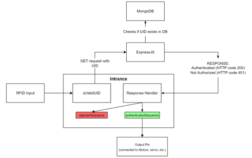
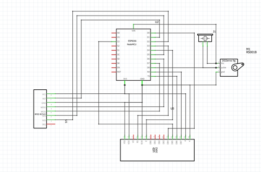

# SmartGate Arduino IoT

This repository contains the source code of our SmartGate Arduino IoT.

## Overview

_Intrance_ SmartGate works by using RC522 RFID module alongside ESP8266 microcontroller for wireless communication. We utilize **ExpressJS** as our backend system that communicates with our database. User's information are stored in **MongoDB Atlas**.

Below is the logic flow behind our system:


## Project Setup

### Backend Systems

This project uses `mongodb` as the cloud service to store user credentials. Our backend system runs on `express-js` to connect to the database & to manage the authentication logic.

#### MongoDB Setup

You can follow the tutorial to setup the MongoDB Atlas cluster [here](https://www.mongodb.com/basics/clusters/mongodb-cluster-setup). The data structure for our `user` object is as follows:

```
User {
    name: String,
    uid: String,
}
```

Keep in mind that MongoDB Atlas will assign `_id` attribute by default.

#### ExpressJS Setup

Navigate to `utils/database.js` and change the credentials (_username, password, dbName, collectionName_) and the URI to appropriately connect to your newly setup MongoDB Atlas cluster.

##### Running ExpressJS Server

Navigate to thte root of the project and run `npm start` to start the backend service locally. `DEFAULT_PORT` is set to **1880**.

### ESP8266 & Board Setup

Here's the schematic of our _Intrance_ SmartGate:


Once the board has been setup, navigate to `ESP8266/SmartGate-servo` and open `SmartGate-servo.ino` using **Arduino IDE**. You can run the script directly from the IDE.
